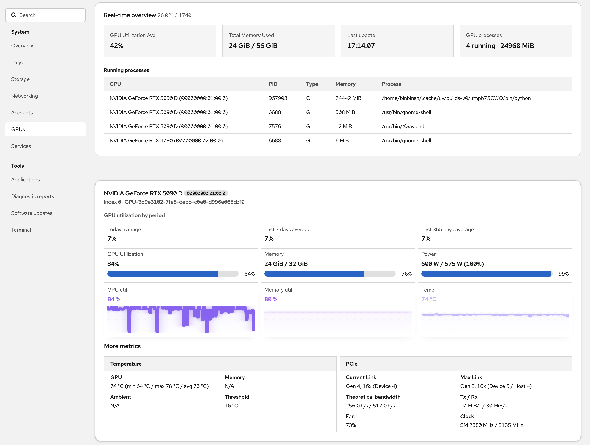

# cockpit-gpu

`cockpit-gpu` is a Cockpit plugin for monitoring NVIDIA GPUs.
It provides:

- Real-time overview
- Per-GPU utilization, memory, and temperature graphs
- Running GPU process list

## Screenshot



## Quick install (from GitHub)

```bash
curl -fsSL https://raw.githubusercontent.com/binbinsh/cockpit-gpu/main/install.sh | bash
```

Default install path:

```bash
~/.local/share/cockpit/gpus
```

## Update

Run the same install command again. It overwrites existing files.

## Uninstall

```bash
rm -rf ~/.local/share/cockpit/gpus
```

Then refresh Cockpit.

## License

This project is licensed under the MIT License.
